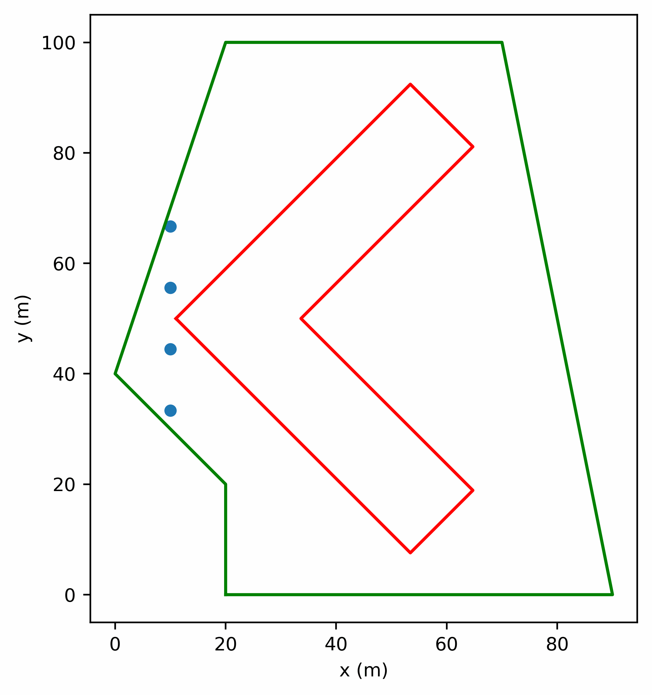

# Ground Heat Exchanger Design Toolbox

The Ground Heat Exchanger Design Toolbox is a Python package that can quantify
the short- and long-term thermal interaction in a ground heat exchanger (GHE).
The long-term thermal response g-functions are computed live-time with 
`pygfunction`. The GHEDT contains a fast monthly hybrid time step simulation 
for prediction of heat pump entering fluid temperatures over a design life. 
GHEDT can vary the size (or borehole height) of a specified borehole field to 
ensure the heat pump entering fluid temperature remains within specified bounds.
GHEDT contains a novel borehole configuration selection algorithm.

## Novel Design Algorithms

GHEDT can consider available drilling and no-drilling zones defined as polygons. 
For more information, refer to Cook (2021).



## Citing GHEDT 

GHEDT and other related work is described in my thesis: 

```angular2html
Cook, J.C. (2021). Development of Computer Programs for Fast Computation of 
    g-Functions and Automated Ground Heat Exchanger Design. Master's Thesis, 
    Oklahoma State University, Stillwater, OK.
```

Here is an example of a BibTeX entry:
```angular2html
@mastersthesis{Cook_2021,
school = "{Oklahoma State University, Stillwater, OK}",
author = {Cook, J C.},
language = {eng},
title = "{Development of Computer Programs for Fast Computation of g-Functions 
and Automated Ground Heat Exchanger Design}",
year = {2021},
}
```
  

## Acknowledgements
The initial release of this work was financially supported by the U.S. 
Department of Energy through research subcontracts from Oak Ridge National 
Laboratory and the National Renewable Energy Laboratory, and by OSU through the 
Center for Integrated Building Systems, the OG&E Energy Technology Chair, and 
Oklahoma State University via return of indirect costs to Dr. Jeffrey D. 
Spitler.
